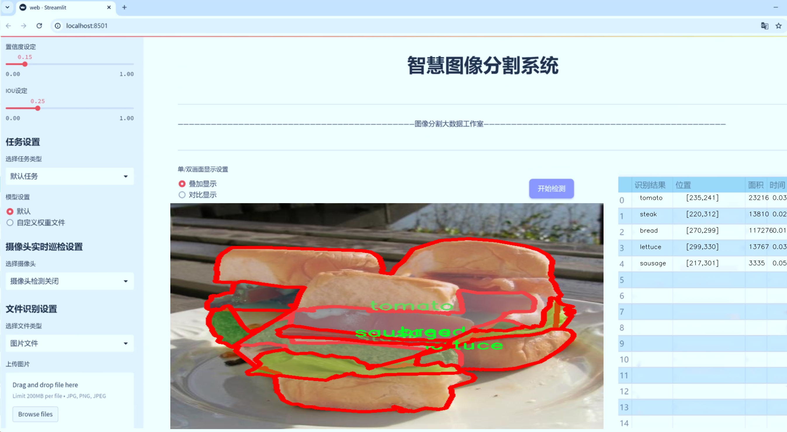
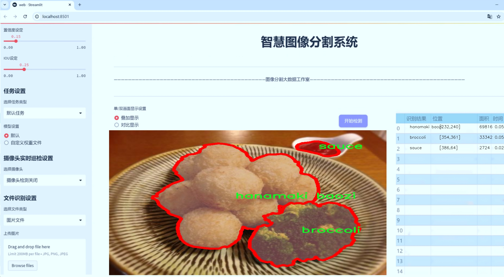
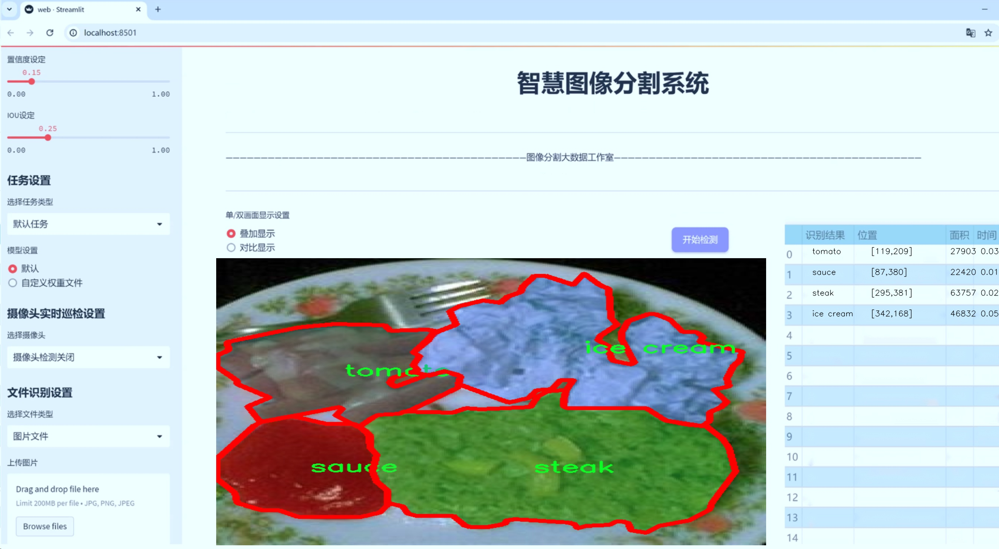
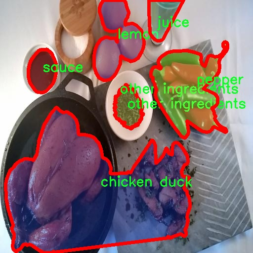
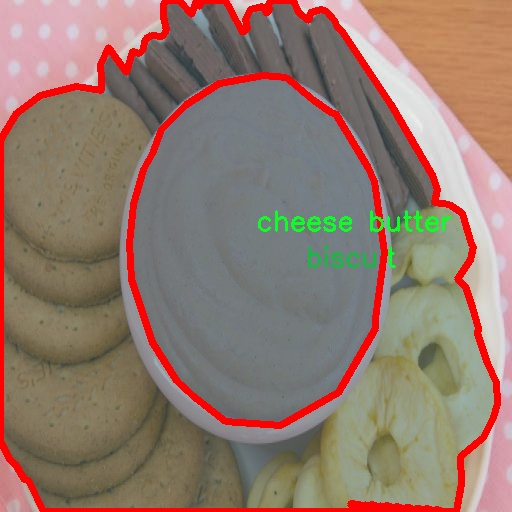
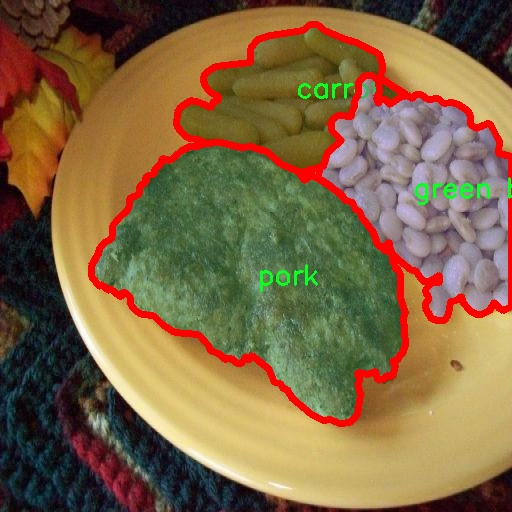
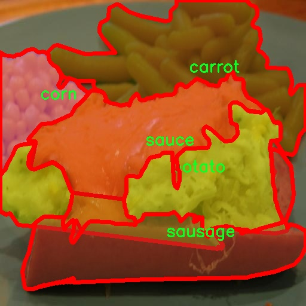
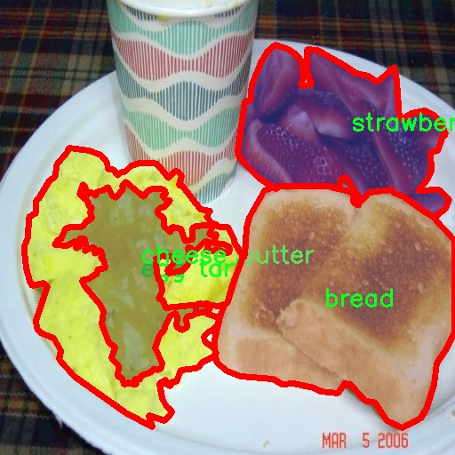

# 食品图像分割系统源码＆数据集分享
 [yolov8-seg＆yolov8-seg-CSwinTransformer等50+全套改进创新点发刊_一键训练教程_Web前端展示]

### 1.研究背景与意义

项目参考[ILSVRC ImageNet Large Scale Visual Recognition Challenge](https://gitee.com/YOLOv8_YOLOv11_Segmentation_Studio/projects)

项目来源[AAAI Global Al lnnovation Contest](https://kdocs.cn/l/cszuIiCKVNis)

研究背景与意义

随着全球人口的不断增长和生活水平的提高，食品安全和营养健康问题日益受到关注。食品图像分析作为计算机视觉领域的重要研究方向，已经在食品质量检测、营养成分分析和智能餐饮服务等多个领域展现出广泛的应用潜力。特别是在深度学习技术的推动下，图像分割技术的进步使得对食品图像的处理更加精准和高效。YOLO（You Only Look Once）系列模型因其快速的检测速度和较高的准确率，成为了图像分割领域的热门选择。尤其是YOLOv8的推出，进一步提升了目标检测和实例分割的性能，为食品图像分析提供了新的技术支持。

本研究旨在基于改进的YOLOv8模型，构建一个高效的食品图像分割系统，以应对食品种类繁多、外观复杂的挑战。所使用的数据集“food v18”包含6600张图像，涵盖104种不同类别的食品，从常见的水果、蔬菜到各类加工食品，种类繁多且具有代表性。这一数据集不仅为模型的训练提供了丰富的样本，还为后续的食品图像分析奠定了坚实的基础。通过对这些图像进行实例分割，可以实现对不同食品成分的精准识别与分类，从而为食品质量监测、营养分析和智能推荐系统提供支持。

研究的意义在于，首先，通过改进YOLOv8模型，可以提升食品图像分割的准确性和实时性，进而推动食品安全检测和营养评估的智能化进程。其次，基于大规模食品图像数据集的训练，将有助于模型在实际应用中的泛化能力，能够适应不同环境和条件下的食品图像处理需求。此外，食品图像分割技术的进步，将为食品行业的数字化转型提供技术支持，促进智能餐饮、食品配送等新兴业务的发展。

在当前全球对健康饮食和食品安全的重视背景下，构建一个高效的食品图像分割系统不仅具有学术研究的价值，更具有广泛的社会意义。通过该系统的应用，可以帮助消费者更好地了解食品成分，促进健康饮食习惯的养成；同时，食品生产和销售企业也能够借助这一技术提升产品质量监控，增强市场竞争力。因此，本研究不仅是对计算机视觉技术在食品领域应用的探索，更是对提升食品安全和营养健康水平的积极贡献。通过这一研究，我们希望能够为未来的食品图像分析提供新的思路和方法，推动相关领域的进一步发展。

### 2.图片演示







##### 注意：由于此博客编辑较早，上面“2.图片演示”和“3.视频演示”展示的系统图片或者视频可能为老版本，新版本在老版本的基础上升级如下：（实际效果以升级的新版本为准）

  （1）适配了YOLOV8的“目标检测”模型和“实例分割”模型，通过加载相应的权重（.pt）文件即可自适应加载模型。

  （2）支持“图片识别”、“视频识别”、“摄像头实时识别”三种识别模式。

  （3）支持“图片识别”、“视频识别”、“摄像头实时识别”三种识别结果保存导出，解决手动导出（容易卡顿出现爆内存）存在的问题，识别完自动保存结果并导出到tempDir中。

  （4）支持Web前端系统中的标题、背景图等自定义修改，后面提供修改教程。

  另外本项目提供训练的数据集和训练教程,暂不提供权重文件（best.pt）,需要您按照教程进行训练后实现图片演示和Web前端界面演示的效果。

### 3.视频演示

[3.1 视频演示](https://www.bilibili.com/video/BV1f8yZYCEPR/)

### 4.数据集信息展示

##### 4.1 本项目数据集详细数据（类别数＆类别名）

nc: 103
names: ['French beans', 'almond', 'apple', 'apricot', 'asparagus', 'avocado', 'bamboo shoots', 'banana', 'bean sprouts', 'biscuit', 'blueberry', 'bread', 'broccoli', 'cabbage', 'cake', 'candy', 'carrot', 'cashew', 'cauliflower', 'celery stick', 'cheese butter', 'cherry', 'chicken duck', 'chocolate', 'cilantro mint', 'coffee', 'corn', 'crab', 'cucumber', 'date', 'dried cranberries', 'egg tart', 'egg', 'eggplant', 'enoki mushroom', 'fig', 'fish', 'french fries', 'fried meat', 'garlic', 'ginger', 'grape', 'green beans', 'hamburg', 'hanamaki baozi', 'ice cream', 'juice', 'kelp', 'king oyster mushroom', 'kiwi', 'lamb', 'lemon', 'lettuce', 'mango', 'melon', 'milk', 'milkshake', 'noodles', 'okra', 'olives', 'onion', 'orange', 'other ingredients', 'oyster mushroom', 'pasta', 'peach', 'peanut', 'pear', 'pepper', 'pie', 'pineapple', 'pizza', 'popcorn', 'pork', 'potato', 'pudding', 'pumpkin', 'rape', 'raspberry', 'red beans', 'rice', 'salad', 'sauce', 'sausage', 'seaweed', 'shellfish', 'shiitake', 'shrimp', 'snow peas', 'soup', 'soy', 'spring onion', 'steak', 'strawberry', 'tea', 'tofu', 'tomato', 'walnut', 'watermelon', 'white button mushroom', 'white radish', 'wine', 'wonton dumplings']


##### 4.2 本项目数据集信息介绍

数据集信息展示

在本研究中，我们使用了名为“food v18”的数据集，旨在改进YOLOv8-seg的食品图像分割系统。该数据集包含了103个不同的食品类别，涵盖了从新鲜蔬菜到各种甜点的广泛食品类型，极大地丰富了模型的训练数据。这种多样性不仅为模型提供了更为全面的学习材料，也增强了其在实际应用中的适应性和准确性。

“food v18”数据集的类别列表非常详尽，涵盖了常见的水果、蔬菜、肉类、乳制品、谷物以及各种加工食品。例如，数据集中包括了法式豆、杏仁、苹果、杏、芦笋、鳄梨等新鲜蔬菜和水果，这些食品不仅在日常饮食中占据重要地位，也在全球范围内受到广泛欢迎。此外，数据集中还包含了多种类型的肉类，如鸡鸭、羊肉和猪肉，以及各种加工食品，如比萨、蛋糕、冰淇淋和饼干等，这些食品在不同文化和饮食习惯中都有其独特的地位。

在数据集的设计上，考虑到了食品的多样性和复杂性。例如，除了常见的食材外，数据集中还包括了如海藻、豆腐、榨菜等一些较为特殊的成分，这些成分在某些特定菜肴中可能扮演着重要角色。此外，数据集中还包含了多种调味品和配料，如香菜、酱油、沙拉等，这些都是现代烹饪中不可或缺的元素。

为了确保模型能够有效地进行图像分割，数据集中的每一类食品都经过精心标注，确保其在图像中的位置和形状信息都能被准确捕捉。这种细致的标注工作不仅提高了数据集的质量，也为后续的模型训练提供了可靠的基础。通过使用“food v18”数据集，YOLOv8-seg模型能够学习到不同食品的特征，从而在图像分割任务中实现更高的准确率和更好的性能。

此外，数据集的丰富性和多样性使得模型在面对不同的食品图像时，能够具备更强的泛化能力。这意味着，经过训练的模型不仅能够在训练数据上表现良好，还能够在未见过的图像中进行有效的分割。这对于实际应用场景，如食品识别、营养分析和智能烹饪等，具有重要的现实意义。

综上所述，“food v18”数据集为改进YOLOv8-seg的食品图像分割系统提供了一个极为丰富和多样的基础。通过对103个食品类别的全面覆盖，该数据集不仅提升了模型的学习能力，也为未来的研究和应用提供了广阔的空间。











### 5.全套项目环境部署视频教程（零基础手把手教学）

[5.1 环境部署教程链接（零基础手把手教学）](https://www.bilibili.com/video/BV1jG4Ve4E9t/?vd_source=bc9aec86d164b67a7004b996143742dc)


[5.2 安装Python虚拟环境创建和依赖库安装视频教程链接（零基础手把手教学）](https://www.bilibili.com/video/BV1nA4VeYEze/?vd_source=bc9aec86d164b67a7004b996143742dc)

### 6.手把手YOLOV8-seg训练视频教程（零基础小白有手就能学会）

[6.1 手把手YOLOV8-seg训练视频教程（零基础小白有手就能学会）](https://www.bilibili.com/video/BV1cA4VeYETe/?vd_source=bc9aec86d164b67a7004b996143742dc)


按照上面的训练视频教程链接加载项目提供的数据集，运行train.py即可开始训练



     Epoch   gpu_mem       box       obj       cls    labels  img_size
     1/200     0G   0.01576   0.01955  0.007536        22      1280: 100%|██████████| 849/849 [14:42<00:00,  1.04s/it]
               Class     Images     Labels          P          R     mAP@.5 mAP@.5:.95: 100%|██████████| 213/213 [01:14<00:00,  2.87it/s]
                 all       3395      17314      0.994      0.957      0.0957      0.0843

     Epoch   gpu_mem       box       obj       cls    labels  img_size
     2/200     0G   0.01578   0.01923  0.007006        22      1280: 100%|██████████| 849/849 [14:44<00:00,  1.04s/it]
               Class     Images     Labels          P          R     mAP@.5 mAP@.5:.95: 100%|██████████| 213/213 [01:12<00:00,  2.95it/s]
                 all       3395      17314      0.996      0.956      0.0957      0.0845

     Epoch   gpu_mem       box       obj       cls    labels  img_size
     3/200     0G   0.01561    0.0191  0.006895        27      1280: 100%|██████████| 849/849 [10:56<00:00,  1.29it/s]
               Class     Images     Labels          P          R     mAP@.5 mAP@.5:.95: 100%|███████   | 187/213 [00:52<00:00,  4.04it/s]
                 all       3395      17314      0.996      0.957      0.0957      0.0845


### 7.50+种全套YOLOV8-seg创新点代码加载调参视频教程（一键加载写好的改进模型的配置文件）

[7.1 50+种全套YOLOV8-seg创新点代码加载调参视频教程（一键加载写好的改进模型的配置文件）](https://www.bilibili.com/video/BV1Hw4VePEXv/?vd_source=bc9aec86d164b67a7004b996143742dc)

### 8.YOLOV8-seg图像分割算法原理

原始YOLOv8-seg算法原理

YOLOv8-seg算法是YOLO系列的最新版本，旨在将目标检测与语义分割相结合，进一步提升计算机视觉任务的性能。作为一种基于卷积神经网络的算法，YOLOv8-seg在YOLOv8的基础上进行了优化和扩展，特别是在特征提取和多尺度处理方面，采用了更深的网络结构和更高效的特征融合技术。这一算法的设计理念是通过对输入图像的全面分析，直接在图像上进行目标检测和分割，避免了传统方法中滑动窗口和区域提议的复杂性，从而显著提高了检测精度和处理速度。

在YOLOv8-seg中，整个网络结构被划分为三个主要部分：Backbone、Neck和Head。Backbone部分负责从输入图像中提取特征，采用了一系列卷积和反卷积层，结合残差连接和瓶颈结构，旨在减小网络的大小并提升性能。具体而言，Backbone使用了C2模块作为基本构成单元，通过多层次的卷积操作提取丰富的特征信息。该部分包含5个CBS模块、4个C2f模块以及1个快速空间金字塔池化（SPPF）模块。SPPF模块的引入使得网络能够处理多尺度特征，增强了特征的抽象能力，从而为后续的目标检测和分割任务奠定了坚实的基础。

Neck部分则采用了多尺度特征融合技术，将来自Backbone不同阶段的特征图进行有效融合。这一过程不仅提升了对不同尺度目标的捕捉能力，还增强了网络的鲁棒性。通过特征金字塔网络（FPN）和路径聚合网络（PAN）的结合，Neck能够有效整合来自不同层次的特征信息，使得YOLOv8-seg在处理复杂场景时表现出色。这种多尺度特征融合的策略使得算法在面对各种尺寸和形状的目标时，能够保持较高的检测精度。

在Head部分，YOLOv8-seg负责最终的目标检测和分割任务。该部分设有多个检测头，专门用于在不同尺寸信息下检测目标。通过解耦的检测头设计，YOLOv8-seg能够通过两个并行的卷积分支分别计算回归和类别的损失，从而实现更为精确的目标定位和分类。此外，Head部分还集成了分割任务的相关模块，使得算法不仅能够识别目标，还能为每个目标生成精确的分割掩码。这一创新使得YOLOv8-seg在图像分割领域具有了更强的竞争力，尤其在需要高精度分割的应用场景中表现尤为突出。

值得注意的是，YOLOv8-seg在训练过程中引入了多尺度训练和测试的策略。这一策略通过在不同的尺度下对图像进行训练，帮助模型学习到更为丰富的特征表示，从而提升了模型的泛化能力和鲁棒性。此外，YOLOv8-seg还利用了数据增强技术，通过对输入图像进行随机裁剪、旋转、翻转等操作，进一步丰富了训练数据集，增强了模型的适应性。

在实际应用中，YOLOv8-seg可以广泛应用于智能监控、自动驾驶、医学影像分析等多个领域。其高效的目标检测和分割能力使得它在处理复杂场景时，能够快速而准确地识别和分割出目标物体。这一算法的出现，不仅为目标检测和分割任务提供了新的解决方案，也为相关领域的研究和应用开辟了新的方向。

总的来说，YOLOv8-seg算法通过深度学习和多尺度特征融合等先进技术，极大地提升了目标检测和分割的性能。其独特的网络结构设计和高效的特征处理能力，使得YOLOv8-seg在面对复杂的视觉任务时，能够展现出优异的性能。这一算法的成功应用，不仅推动了计算机视觉技术的发展，也为未来的研究提供了新的思路和方向。随着YOLOv8-seg的不断优化和迭代，我们有理由相信，它将在更多的实际应用中发挥重要作用，助力各行各业的智能化进程。


### 9.系统功能展示（检测对象为举例，实际内容以本项目数据集为准）

图9.1.系统支持检测结果表格显示

  图9.2.系统支持置信度和IOU阈值手动调节

  图9.3.系统支持自定义加载权重文件best.pt(需要你通过步骤5中训练获得)

  图9.4.系统支持摄像头实时识别

  图9.5.系统支持图片识别

  图9.6.系统支持视频识别

  图9.7.系统支持识别结果文件自动保存

  图9.8.系统支持Excel导出检测结果数据


### 10.50+种全套YOLOV8-seg创新点原理讲解（非科班也可以轻松写刊发刊，V11版本正在科研待更新）

#### 10.1 由于篇幅限制，每个创新点的具体原理讲解就不一一展开，具体见下列网址中的创新点对应子项目的技术原理博客网址【Blog】：


[10.1 50+种全套YOLOV8-seg创新点原理讲解链接](https://gitee.com/qunmasj/good)

#### 10.2 部分改进模块原理讲解(完整的改进原理见上图和技术博客链接)【如果此小节的图加载失败可以通过CSDN或者Github搜索该博客的标题访问原始博客，原始博客图片显示正常】

### YOLOv8简介
#### Backbone
Darknet-53
53指的是“52层卷积”+output layer。

借鉴了其他算法的这些设计思想

借鉴了VGG的思想，使用了较多的3×3卷积，在每一次池化操作后，将通道数翻倍；

借鉴了network in network的思想，使用全局平均池化（global average pooling）做预测，并把1×1的卷积核置于3×3的卷积核之间，用来压缩特征；（我没找到这一步体现在哪里）


使用了批归一化层稳定模型训练，加速收敛，并且起到正则化作用。

    以上三点为Darknet19借鉴其他模型的点。Darknet53当然是在继承了Darknet19的这些优点的基础上再新增了下面这些优点的。因此列在了这里

借鉴了ResNet的思想，在网络中大量使用了残差连接，因此网络结构可以设计的很深，并且缓解了训练中梯度消失的问题，使得模型更容易收敛。

使用步长为2的卷积层代替池化层实现降采样。（这一点在经典的Darknet-53上是很明显的，output的长和宽从256降到128，再降低到64，一路降低到8，应该是通过步长为2的卷积层实现的；在YOLOv8的卷积层中也有体现，比如图中我标出的这些位置）

#### 特征融合

模型架构图如下

  Darknet-53的特点可以这样概括：（Conv卷积模块+Residual Block残差块）串行叠加4次

  Conv卷积层+Residual Block残差网络就被称为一个stage


上面红色指出的那个，原始的Darknet-53里面有一层 卷积，在YOLOv8里面，把一层卷积移除了

为什么移除呢？

        原始Darknet-53模型中间加的这个卷积层做了什么？滤波器（卷积核）的个数从 上一个卷积层的512个，先增加到1024个卷积核，然后下一层卷积的卷积核的个数又降低到512个

        移除掉这一层以后，少了1024个卷积核，就可以少做1024次卷积运算，同时也少了1024个3×3的卷积核的参数，也就是少了9×1024个参数需要拟合。这样可以大大减少了模型的参数，（相当于做了轻量化吧）

        移除掉这个卷积层，可能是因为作者发现移除掉这个卷积层以后，模型的score有所提升，所以才移除掉的。为什么移除掉以后，分数有所提高呢？可能是因为多了这些参数就容易，参数过多导致模型在训练集删过拟合，但是在测试集上表现很差，最终模型的分数比较低。你移除掉这个卷积层以后，参数减少了，过拟合现象不那么严重了，泛化能力增强了。当然这个是，拿着你做实验的结论，反过来再找补，再去强行解释这种现象的合理性。


通过MMdetection官方绘制册这个图我们可以看到，进来的这张图片经过一个“Feature Pyramid Network(简称FPN)”，然后最后的P3、P4、P5传递给下一层的Neck和Head去做识别任务。 PAN（Path Aggregation Network）


“FPN是自顶向下，将高层的强语义特征传递下来。PAN就是在FPN的后面添加一个自底向上的金字塔，对FPN补充，将低层的强定位特征传递上去，

FPN是自顶（小尺寸，卷积次数多得到的结果，语义信息丰富）向下（大尺寸，卷积次数少得到的结果），将高层的强语义特征传递下来，对整个金字塔进行增强，不过只增强了语义信息，对定位信息没有传递。PAN就是针对这一点，在FPN的后面添加一个自底（卷积次数少，大尺寸）向上（卷积次数多，小尺寸，语义信息丰富）的金字塔，对FPN补充，将低层的强定位特征传递上去，又被称之为“双塔战术”。

FPN层自顶向下传达强语义特征，而特征金字塔则自底向上传达强定位特征，两两联手，从不同的主干层对不同的检测层进行参数聚合,这样的操作确实很皮。
#### 自底向上增强


而 PAN（Path Aggregation Network）是对 FPN 的一种改进，它的设计理念是在 FPN 后面添加一个自底向上的金字塔。PAN 引入了路径聚合的方式，通过将浅层特征图（低分辨率但语义信息较弱）和深层特征图（高分辨率但语义信息丰富）进行聚合，并沿着特定的路径传递特征信息，将低层的强定位特征传递上去。这样的操作能够进一步增强多尺度特征的表达能力，使得 PAN 在目标检测任务中表现更加优秀。


### Gold-YOLO简介
YOLO系列模型面世至今已有8年，由于其优异的性能，已成为目标检测领域的标杆。在系列模型经过十多个不同版本的改进发展逐渐稳定完善的今天，研究人员更多关注于单个计算模块内结构的精细调整，或是head部分和训练方法上的改进。但这并不意味着现有模式已是最优解。

当前YOLO系列模型通常采用类FPN方法进行信息融合，而这一结构在融合跨层信息时存在信息损失的问题。针对这一问题，我们提出了全新的信息聚集-分发（Gather-and-Distribute Mechanism）GD机制，通过在全局视野上对不同层级的特征进行统一的聚集融合并分发注入到不同层级中，构建更加充分高效的信息交互融合机制，并基于GD机制构建了Gold-YOLO。在COCO数据集中，我们的Gold-YOLO超越了现有的YOLO系列，实现了精度-速度曲线上的SOTA。


精度和速度曲线（TensorRT7）


精度和速度曲线（TensorRT8）
传统YOLO的问题
在检测模型中，通常先经过backbone提取得到一系列不同层级的特征，FPN利用了backbone的这一特点，构建了相应的融合结构：不层级的特征包含着不同大小物体的位置信息，虽然这些特征包含的信息不同，但这些特征在相互融合后能够互相弥补彼此缺失的信息，增强每一层级信息的丰富程度，提升网络性能。

原始的FPN结构由于其层层递进的信息融合模式，使得相邻层的信息能够充分融合，但也导致了跨层信息融合存在问题：当跨层的信息进行交互融合时，由于没有直连的交互通路，只能依靠中间层充当“中介”进行融合，导致了一定的信息损失。之前的许多工作中都关注到了这一问题，而解决方案通常是通过添加shortcut增加更多的路径，以增强信息流动。

然而传统的FPN结构即便改进后，由于网络中路径过多，且交互方式不直接，基于FPN思想的信息融合结构仍然存在跨层信息交互困难和信息损失的问题。

#### Gold-YOLO：全新的信息融合交互机制


#### Gold-YOLO架构
参考该博客提出的一种全新的信息交互融合机制：信息聚集-分发机制(Gather-and-Distribute Mechanism)。该机制通过在全局上融合不同层次的特征得到全局信息，并将全局信息注入到不同层级的特征中，实现了高效的信息交互和融合。在不显著增加延迟的情况下GD机制显著增强了Neck部分的信息融合能力，提高了模型对不同大小物体的检测能力。

GD机制通过三个模块实现：信息对齐模块(FAM)、信息融合模块(IFM)和信息注入模块(Inject)。

信息对齐模块负责收集并对齐不同层级不同大小的特征

信息融合模块通过使用卷积或Transformer算子对对齐后的的特征进行融合，得到全局信息

信息注入模块将全局信息注入到不同层级中

在Gold-YOLO中，针对模型需要检测不同大小的物体的需要，并权衡精度和速度，我们构建了两个GD分支对信息进行融合：低层级信息聚集-分发分支(Low-GD)和高层级信息聚集-分发分支(High-GD)，分别基于卷积和transformer提取和融合特征信息。

此外,为了促进局部信息的流动，我们借鉴现有工作，构建了一个轻量级的邻接层融合模块，该模块在局部尺度上结合了邻近层的特征，进一步提升了模型性能。我们还引入并验证了预训练方法对YOLO模型的有效性，通过在ImageNet 1K上使用MAE方法对主干进行预训练，显著提高了模型的收敛速度和精度。


### 11.项目核心源码讲解（再也不用担心看不懂代码逻辑）

#### 11.1 ultralytics\models\yolo\classify\train.py

以下是经过精简和注释的核心代码部分，主要保留了与分类训练相关的功能：

```python
import torch
from ultralytics.data import ClassificationDataset, build_dataloader
from ultralytics.engine.trainer import BaseTrainer
from ultralytics.models import yolo
from ultralytics.nn.tasks import ClassificationModel
from ultralytics.utils import DEFAULT_CFG, LOGGER, RANK, colorstr
from ultralytics.utils.torch_utils import is_parallel, strip_optimizer, torch_distributed_zero_first

class ClassificationTrainer(BaseTrainer):
    """
    分类训练器类，继承自 BaseTrainer 类，用于基于分类模型的训练。
    """

    def __init__(self, cfg=DEFAULT_CFG, overrides=None, _callbacks=None):
        """初始化 ClassificationTrainer 对象，接受可选的配置覆盖和回调函数。"""
        if overrides is None:
            overrides = {}
        overrides['task'] = 'classify'  # 设置任务类型为分类
        if overrides.get('imgsz') is None:
            overrides['imgsz'] = 224  # 默认图像大小
        super().__init__(cfg, overrides, _callbacks)

    def set_model_attributes(self):
        """从加载的数据集中设置 YOLO 模型的类名。"""
        self.model.names = self.data['names']

    def get_model(self, cfg=None, weights=None, verbose=True):
        """返回配置好的 PyTorch 模型以用于 YOLO 训练。"""
        model = ClassificationModel(cfg, nc=self.data['nc'], verbose=verbose and RANK == -1)
        if weights:
            model.load(weights)  # 加载权重

        for m in model.modules():
            if not self.args.pretrained and hasattr(m, 'reset_parameters'):
                m.reset_parameters()  # 重置参数
        for p in model.parameters():
            p.requires_grad = True  # 设置为可训练
        return model

    def build_dataset(self, img_path, mode='train'):
        """根据图像路径和模式（训练/测试等）创建 ClassificationDataset 实例。"""
        return ClassificationDataset(root=img_path, args=self.args, augment=mode == 'train', prefix=mode)

    def get_dataloader(self, dataset_path, batch_size=16, rank=0, mode='train'):
        """返回用于推理的 PyTorch DataLoader，并进行图像预处理。"""
        with torch_distributed_zero_first(rank):  # 在分布式训练中仅初始化一次数据集
            dataset = self.build_dataset(dataset_path, mode)

        loader = build_dataloader(dataset, batch_size, self.args.workers, rank=rank)
        # 附加推理变换
        if mode != 'train':
            if is_parallel(self.model):
                self.model.module.transforms = loader.dataset.torch_transforms
            else:
                self.model.transforms = loader.dataset.torch_transforms
        return loader

    def preprocess_batch(self, batch):
        """预处理一批图像和类标签。"""
        batch['img'] = batch['img'].to(self.device)  # 将图像移到设备上
        batch['cls'] = batch['cls'].to(self.device)  # 将类标签移到设备上
        return batch

    def get_validator(self):
        """返回 ClassificationValidator 实例以进行验证。"""
        self.loss_names = ['loss']  # 定义损失名称
        return yolo.classify.ClassificationValidator(self.test_loader, self.save_dir)

    def final_eval(self):
        """评估训练后的模型并保存验证结果。"""
        for f in self.last, self.best:
            if f.exists():
                strip_optimizer(f)  # 去除优化器信息
                if f is self.best:
                    LOGGER.info(f'\nValidating {f}...')
                    self.metrics = self.validator(model=f)  # 进行验证
                    self.metrics.pop('fitness', None)  # 移除不需要的指标
        LOGGER.info(f"Results saved to {colorstr('bold', self.save_dir)}")  # 输出结果保存路径
```

### 代码说明：
1. **导入必要的库**：引入了 PyTorch 和 Ultralytics 的相关模块。
2. **ClassificationTrainer 类**：这是主要的训练类，负责模型的初始化、数据集的构建、数据加载器的创建以及模型的训练和验证。
3. **初始化方法**：设置任务类型为分类，并定义默认的图像大小。
4. **模型设置**：通过 `set_model_attributes` 方法设置模型的类名，通过 `get_model` 方法获取和配置模型。
5. **数据集和数据加载器**：`build_dataset` 方法创建数据集，`get_dataloader` 方法返回数据加载器，并进行必要的图像预处理。
6. **预处理批次**：`preprocess_batch` 方法将图像和类标签移到指定设备上。
7. **验证器**：`get_validator` 方法返回用于验证的实例。
8. **最终评估**：`final_eval` 方法用于评估训练后的模型并保存结果。

这些核心部分涵盖了分类训练的主要流程和功能。

这个文件是Ultralytics YOLO框架中的一个分类训练模块，主要用于训练基于YOLO模型的图像分类任务。文件中定义了一个名为`ClassificationTrainer`的类，该类继承自`BaseTrainer`，并实现了一系列用于训练分类模型的方法。

在类的初始化方法中，首先设置了一些默认参数，比如任务类型为分类（'classify'），并确保输入图像的大小为224。如果用户提供了其他参数，这些参数会覆盖默认设置。

`set_model_attributes`方法用于从加载的数据集中设置YOLO模型的类名，这样模型就能识别不同的类别。

`get_model`方法负责返回一个配置好的PyTorch模型，适用于YOLO训练。如果用户提供了权重文件，该方法会加载这些权重。它还会根据用户的设置调整模型的参数，比如重置某些层的参数或设置dropout率。

`setup_model`方法用于加载、创建或下载模型。如果模型已经是一个PyTorch模块，则不需要再次设置。如果模型是以`.pt`结尾的文件，它会尝试加载权重；如果是以`.yaml`结尾的配置文件，则会调用`get_model`方法；如果是Torchvision中的模型，则会直接从Torchvision中加载。

`build_dataset`方法用于创建一个`ClassificationDataset`实例，给定图像路径和模式（如训练或测试）。`get_dataloader`方法则返回一个PyTorch的DataLoader，用于对图像进行预处理和加载。

`preprocess_batch`方法对一批图像和类别进行预处理，将它们移动到指定的设备上（如GPU）。

`progress_string`方法返回一个格式化的字符串，显示训练进度，包括当前的epoch、GPU内存使用情况和损失值等。

`get_validator`方法返回一个用于验证的`ClassificationValidator`实例，损失名称被设置为'loss'。

`label_loss_items`方法返回一个带有标签的损失字典，尽管对于分类任务并不需要，但为了兼容其他任务（如分割和检测），该方法仍然存在。

`plot_metrics`方法用于从CSV文件中绘制训练过程中的指标，并保存结果图像。

`final_eval`方法在训练结束后评估训练好的模型，并保存验证结果。如果存在最后的模型和最佳模型文件，它会剥离优化器信息，并进行验证。

最后，`plot_training_samples`方法用于绘制训练样本及其注释，以便可视化训练过程中的数据。

整体来看，这个文件实现了YOLO模型在图像分类任务中的训练过程，涵盖了模型的初始化、数据加载、训练、验证和结果可视化等多个方面。

#### 11.2 ultralytics\nn\__init__.py

```python
# 导入所需的模型任务类和函数
from .tasks import (BaseModel, ClassificationModel, DetectionModel, SegmentationModel, 
                    attempt_load_one_weight, attempt_load_weights, guess_model_scale, 
                    guess_model_task, parse_model, torch_safe_load, yaml_model_load)

# 定义模块的公开接口，包含可供外部使用的类和函数
__all__ = ('attempt_load_one_weight', 'attempt_load_weights', 'parse_model', 'yaml_model_load', 
           'guess_model_task', 'guess_model_scale', 'torch_safe_load', 
           'DetectionModel', 'SegmentationModel', 'ClassificationModel', 'BaseModel')
```

### 代码注释说明：

1. **导入模块**：
   - `from .tasks import ...`：从当前包的 `tasks` 模块中导入多个类和函数。这些类和函数用于处理不同的模型任务，如分类、检测和分割等。

2. **公开接口定义**：
   - `__all__`：这是一个特殊的变量，用于定义当使用 `from module import *` 时，哪些类和函数会被导入。它确保只有列出的内容会被公开，其他内容将被隐藏，从而保护模块的内部实现。

3. **导入的内容**：
   - `BaseModel`：基础模型类，可能包含所有模型的共通功能。
   - `ClassificationModel`：分类模型类，用于处理图像分类任务。
   - `DetectionModel`：检测模型类，用于处理目标检测任务。
   - `SegmentationModel`：分割模型类，用于处理图像分割任务。
   - `attempt_load_one_weight`：尝试加载单个权重文件的函数。
   - `attempt_load_weights`：尝试加载多个权重文件的函数。
   - `guess_model_scale`：根据某些标准猜测模型的缩放比例的函数。
   - `guess_model_task`：根据模型的特征猜测其任务类型的函数。
   - `parse_model`：解析模型结构的函数。
   - `torch_safe_load`：安全加载 PyTorch 模型的函数。
   - `yaml_model_load`：从 YAML 文件加载模型配置的函数。

通过这些导入和定义，模块能够为用户提供多种模型相关的功能，方便进行模型的加载和使用。

这个程序文件是Ultralytics YOLO（You Only Look Once）项目的一部分，主要用于深度学习模型的定义和加载。文件的开头包含了版权信息，表明该代码遵循AGPL-3.0许可证。

在文件中，首先从同一包的`tasks`模块中导入了一系列类和函数。这些导入的内容包括基础模型类（`BaseModel`）、分类模型类（`ClassificationModel`）、检测模型类（`DetectionModel`）、分割模型类（`SegmentationModel`），以及一些与模型加载和解析相关的函数，如`attempt_load_one_weight`、`attempt_load_weights`、`guess_model_scale`、`guess_model_task`、`parse_model`、`torch_safe_load`和`yaml_model_load`。

接下来，`__all__`变量被定义，用于指定在使用`from module import *`语句时，哪些名称会被导入。这里列出的名称包括了之前导入的函数和类，这样可以方便用户了解该模块提供的接口。

总体来说，这个文件的主要功能是组织和导出与YOLO模型相关的核心组件，便于其他模块或用户进行调用和使用。通过这种方式，Ultralytics YOLO能够提供一个清晰的API，帮助用户快速上手和实现各种计算机视觉任务。

#### 11.3 ui.py

```python
import sys
import subprocess

def run_script(script_path):
    """
    使用当前 Python 环境运行指定的脚本。

    Args:
        script_path (str): 要运行的脚本路径

    Returns:
        None
    """
    # 获取当前 Python 解释器的路径
    python_path = sys.executable

    # 构建运行命令，使用 streamlit 运行指定的脚本
    command = f'"{python_path}" -m streamlit run "{script_path}"'

    # 执行命令并等待其完成
    result = subprocess.run(command, shell=True)
    
    # 检查命令执行结果，如果返回码不为0，则表示出错
    if result.returncode != 0:
        print("脚本运行出错。")


# 实例化并运行应用
if __name__ == "__main__":
    # 指定要运行的脚本路径
    script_path = "web.py"  # 这里可以直接使用相对路径

    # 调用函数运行脚本
    run_script(script_path)
```

### 代码注释说明：

1. **导入模块**：
   - `sys`：用于访问与 Python 解释器紧密相关的变量和函数。
   - `subprocess`：用于创建新进程、连接到它们的输入/输出/错误管道，并获取返回码。

2. **定义 `run_script` 函数**：
   - 该函数接受一个参数 `script_path`，表示要运行的 Python 脚本的路径。
   - 函数内部首先获取当前 Python 解释器的路径，以便后续执行脚本时使用。

3. **构建命令**：
   - 使用 f-string 格式化字符串，构建一个命令，该命令将使用 `streamlit` 模块运行指定的脚本。

4. **执行命令**：
   - 使用 `subprocess.run` 方法执行构建的命令，并设置 `shell=True` 以便在 shell 中运行命令。
   - 该方法会等待命令执行完成，并返回一个结果对象。

5. **检查执行结果**：
   - 通过检查 `result.returncode` 来判断命令是否成功执行。如果返回码不为0，表示执行过程中出现错误，打印错误信息。

6. **主程序入口**：
   - 使用 `if __name__ == "__main__":` 确保只有在直接运行该脚本时才会执行以下代码。
   - 指定要运行的脚本路径，并调用 `run_script` 函数执行该脚本。

这个程序文件名为 `ui.py`，其主要功能是使用当前的 Python 环境来运行一个指定的脚本，具体是一个名为 `web.py` 的文件。程序首先导入了必要的模块，包括 `sys`、`os` 和 `subprocess`，这些模块分别用于获取系统信息、操作系统功能和执行外部命令。

在文件中定义了一个名为 `run_script` 的函数，该函数接受一个参数 `script_path`，表示要运行的脚本的路径。函数内部首先获取当前 Python 解释器的路径，这通过 `sys.executable` 实现。接着，构建一个命令字符串，使用 `streamlit` 模块来运行指定的脚本。命令的格式是 `"{python_path}" -m streamlit run "{script_path}"`，其中 `python_path` 是当前 Python 解释器的路径，`script_path` 是传入的脚本路径。

然后，使用 `subprocess.run` 方法来执行这个命令，`shell=True` 参数允许在 shell 中执行命令。执行完后，程序检查返回的结果码，如果不为零，表示脚本运行出错，程序会打印出“脚本运行出错。”的提示信息。

在文件的最后部分，使用 `if __name__ == "__main__":` 来确保只有在直接运行该文件时才会执行以下代码。此处指定了要运行的脚本路径为 `web.py`，并调用 `run_script` 函数来执行这个脚本。

总的来说，这个程序的作用是方便地通过 Python 环境运行一个特定的脚本，并处理可能出现的错误。

#### 11.4 train.py

以下是经过简化和注释的核心代码部分：

```python
import os
import torch
import yaml
from ultralytics import YOLO  # 导入YOLO模型

if __name__ == '__main__':  # 确保该模块被直接运行时才执行以下代码
    # 设置训练参数
    workers = 1  # 数据加载时使用的工作进程数量
    batch = 8  # 每个批次的样本数量
    device = "0" if torch.cuda.is_available() else "cpu"  # 判断是否使用GPU

    # 获取数据集配置文件的绝对路径
    data_path = abs_path(f'datasets/data/data.yaml', path_type='current')

    # 将路径格式转换为Unix风格
    unix_style_path = data_path.replace(os.sep, '/')
    # 获取数据集目录路径
    directory_path = os.path.dirname(unix_style_path)

    # 读取YAML文件，保持原有顺序
    with open(data_path, 'r') as file:
        data = yaml.load(file, Loader=yaml.FullLoader)

    # 修改数据集路径
    if 'train' in data and 'val' in data and 'test' in data:
        data['train'] = directory_path + '/train'  # 更新训练集路径
        data['val'] = directory_path + '/val'      # 更新验证集路径
        data['test'] = directory_path + '/test'    # 更新测试集路径

        # 将修改后的数据写回YAML文件
        with open(data_path, 'w') as file:
            yaml.safe_dump(data, file, sort_keys=False)

    # 加载YOLO模型配置并加载预训练权重
    model = YOLO(r"C:\codeseg\codenew\50+种YOLOv8算法改进源码大全和调试加载训练教程（非必要）\改进YOLOv8模型配置文件\yolov8-seg-C2f-Faster.yaml").load("./weights/yolov8s-seg.pt")

    # 开始训练模型
    results = model.train(
        data=data_path,  # 指定训练数据的配置文件路径
        device=device,  # 指定使用的设备（GPU或CPU）
        workers=workers,  # 指定数据加载的工作进程数量
        imgsz=640,  # 输入图像的大小
        epochs=100,  # 训练的轮数
        batch=batch,  # 每个批次的样本数量
    )
```

### 代码注释说明：
1. **导入必要的库**：导入了操作系统、PyTorch、YAML解析库和YOLO模型。
2. **设置训练参数**：定义了数据加载的工作进程数量、批次大小和设备类型（GPU或CPU）。
3. **获取数据集配置文件路径**：使用`abs_path`函数获取数据集的YAML配置文件的绝对路径，并转换为Unix风格路径。
4. **读取和修改YAML文件**：读取YAML文件内容，更新训练、验证和测试集的路径，并将修改后的内容写回文件。
5. **加载YOLO模型**：根据指定的配置文件加载YOLO模型及其预训练权重。
6. **开始训练模型**：调用`model.train`方法开始训练，传入数据路径、设备、工作进程数量、图像大小、训练轮数和批次大小等参数。

这个程序文件 `train.py` 是用于训练 YOLO（You Only Look Once）模型的脚本，主要使用了 PyTorch 框架和 Ultralytics 提供的 YOLO 实现。程序的主要流程如下：

首先，程序导入了必要的库，包括 `os`、`torch`、`yaml` 和 `matplotlib`。其中，`torch` 是用于深度学习的库，`yaml` 用于处理 YAML 格式的配置文件，`matplotlib` 则用于可视化。

在 `__main__` 块中，程序首先设置了一些训练参数，包括工作进程数 `workers`、批次大小 `batch`、以及设备类型 `device`。设备类型会根据是否有可用的 GPU 来决定，如果有 GPU 则使用 GPU（设备编号为 "0"），否则使用 CPU。

接下来，程序通过 `abs_path` 函数获取数据集配置文件的绝对路径。这个配置文件是一个 YAML 文件，包含了训练、验证和测试数据的路径。程序将路径中的分隔符统一替换为 Unix 风格的斜杠，以确保在不同操作系统上都能正确处理。

程序读取 YAML 文件的内容，并检查其中是否包含 `train`、`val` 和 `test` 项。如果存在这些项，程序会将它们的路径修改为相对于数据集目录的路径，并将修改后的内容写回到 YAML 文件中。这一步确保了数据集路径的正确性。

接下来，程序加载 YOLO 模型的配置文件，并加载预训练的权重文件。这里的模型配置文件路径和权重文件路径是硬编码的，用户可以根据需要进行修改。

最后，程序调用 `model.train()` 方法开始训练模型。训练时指定了数据配置文件路径、设备、工作进程数、输入图像大小（640x640）、训练的 epoch 数（100）以及批次大小（8）。这些参数可以根据具体的训练需求进行调整。

总的来说，这个脚本提供了一个完整的训练流程，从数据路径的设置到模型的加载和训练，适合用于 YOLO 模型的训练任务。

#### 11.5 ultralytics\nn\extra_modules\afpn.py

以下是经过简化和注释的核心代码部分，主要保留了与特征金字塔网络（FPN）相关的类和方法：

```python
import torch
import torch.nn as nn
import torch.nn.functional as F
from ..modules.conv import Conv

# 定义基本的卷积块
class BasicBlock(nn.Module):
    def __init__(self, filter_in, filter_out):
        super(BasicBlock, self).__init__()
        # 定义两个卷积层
        self.conv1 = Conv(filter_in, filter_out, 3)
        self.conv2 = Conv(filter_out, filter_out, 3, act=False)

    def forward(self, x):
        residual = x  # 保存输入以便后续的残差连接
        out = self.conv1(x)  # 第一个卷积层
        out = self.conv2(out)  # 第二个卷积层
        out += residual  # 残差连接
        return self.conv1.act(out)  # 激活输出

# 定义上采样模块
class Upsample(nn.Module):
    def __init__(self, in_channels, out_channels, scale_factor=2):
        super(Upsample, self).__init__()
        # 定义上采样的卷积层和上采样操作
        self.upsample = nn.Sequential(
            Conv(in_channels, out_channels, 1),
            nn.Upsample(scale_factor=scale_factor, mode='bilinear')
        )

    def forward(self, x):
        return self.upsample(x)  # 执行上采样

# 定义自适应特征融合模块（ASFF）
class ASFF_2(nn.Module):
    def __init__(self, inter_dim=512):
        super(ASFF_2, self).__init__()
        compress_c = 8  # 压缩通道数
        # 定义用于计算权重的卷积层
        self.weight_level_1 = Conv(inter_dim, compress_c, 1)
        self.weight_level_2 = Conv(inter_dim, compress_c, 1)
        self.weight_levels = nn.Conv2d(compress_c * 2, 2, kernel_size=1)  # 权重层
        self.conv = Conv(inter_dim, inter_dim, 3)  # 最后的卷积层

    def forward(self, input1, input2):
        # 计算输入特征的权重
        level_1_weight_v = self.weight_level_1(input1)
        level_2_weight_v = self.weight_level_2(input2)
        levels_weight_v = torch.cat((level_1_weight_v, level_2_weight_v), 1)  # 拼接权重
        levels_weight = self.weight_levels(levels_weight_v)  # 计算最终权重
        levels_weight = F.softmax(levels_weight, dim=1)  # 应用softmax

        # 融合特征
        fused_out_reduced = input1 * levels_weight[:, 0:1, :, :] + input2 * levels_weight[:, 1:2, :, :]
        out = self.conv(fused_out_reduced)  # 通过卷积层输出
        return out

# 定义特征金字塔网络（FPN）类
class AFPN_P345(nn.Module):
    def __init__(self, in_channels=[256, 512, 1024], out_channels=256, factor=4):
        super(AFPN_P345, self).__init__()
        # 定义输入通道到输出通道的卷积层
        self.conv0 = Conv(in_channels[0], in_channels[0] // factor, 1)
        self.conv1 = Conv(in_channels[1], in_channels[1] // factor, 1)
        self.conv2 = Conv(in_channels[2], in_channels[2] // factor, 1)

        # 定义特征融合体
        self.body = BlockBody_P345([in_channels[0] // factor, in_channels[1] // factor, in_channels[2] // factor])

        # 定义输出卷积层
        self.conv00 = Conv(in_channels[0] // factor, out_channels, 1)
        self.conv11 = Conv(in_channels[1] // factor, out_channels, 1)
        self.conv22 = Conv(in_channels[2] // factor, out_channels, 1)

        # 初始化权重
        for m in self.modules():
            if isinstance(m, nn.Conv2d):
                nn.init.xavier_normal_(m.weight, gain=0.02)
            elif isinstance(m, nn.BatchNorm2d):
                torch.nn.init.normal_(m.weight.data, 1.0, 0.02)
                torch.nn.init.constant_(m.bias.data, 0.0)

    def forward(self, x):
        x0, x1, x2 = x  # 输入特征
        x0 = self.conv0(x0)  # 通过卷积层处理
        x1 = self.conv1(x1)
        x2 = self.conv2(x2)

        out0, out1, out2 = self.body([x0, x1, x2])  # 通过特征融合体处理
        out0 = self.conv00(out0)  # 输出卷积处理
        out1 = self.conv11(out1)
        out2 = self.conv22(out2)
        return [out0, out1, out2]  # 返回输出特征
```

### 代码说明：
1. **BasicBlock**：实现了一个基本的卷积块，包含两个卷积层和残差连接。
2. **Upsample**：实现了上采样操作，结合了卷积和双线性插值。
3. **ASFF_2**：实现了自适应特征融合模块，能够根据输入特征计算权重并融合特征。
4. **AFPN_P345**：实现了特征金字塔网络的核心结构，负责处理输入特征并生成输出特征。通过卷积层和特征融合体来增强特征表示。

这些类和方法构成了特征金字塔网络的基础，适用于目标检测和图像分割等任务。

这个程序文件定义了一些用于构建特征金字塔网络（FPN）的模块，主要用于计算机视觉任务，特别是目标检测和分割。文件中包含多个类，每个类实现了不同的功能模块。

首先，`BasicBlock`类实现了一个基本的卷积块，包含两个卷积层和残差连接。它通过`forward`方法接收输入并返回经过卷积处理后的输出。

接下来，`Upsample`和`Downsample_x2`、`Downsample_x4`、`Downsample_x8`类分别实现了上采样和不同倍数的下采样操作。这些类使用卷积层和上采样层（如双线性插值）来改变特征图的尺寸。

`ASFF_2`、`ASFF_3`和`ASFF_4`类实现了自适应特征融合模块（ASFF），它们通过对输入特征图进行加权融合来增强特征表示。每个类的构造函数定义了权重卷积层和输出卷积层，而`forward`方法则计算输入特征图的加权和。

`BlockBody_P345`和`BlockBody_P2345`类分别实现了不同规模的特征处理模块。它们使用多个卷积块、下采样和上采样操作来处理输入特征图，并通过ASFF模块进行特征融合。`BlockBody_P345_Custom`和`BlockBody_P2345_Custom`类则允许用户自定义卷积块的类型。

`AFPN_P345`和`AFPN_P2345`类是特征金字塔网络的核心类，它们接收不同尺度的输入特征图，经过卷积和特征处理模块后输出融合后的特征图。它们的构造函数中定义了输入通道、输出通道和其他参数，并在`forward`方法中实现了前向传播。

最后，`AFPN_P345_Custom`和`AFPN_P2345_Custom`类允许用户自定义特征金字塔网络的构建，用户可以指定不同的卷积块类型。

整体来看，这个文件提供了一种灵活的方式来构建和扩展特征金字塔网络，适用于各种计算机视觉任务。

#### 11.6 ultralytics\models\sam\modules\decoders.py

以下是经过简化和注释的核心代码部分，主要集中在 `MaskDecoder` 类的实现上：

```python
import torch
from torch import nn
from typing import Tuple

class MaskDecoder(nn.Module):
    """
    MaskDecoder 类用于生成图像的掩码及其质量评分，使用变换器架构根据图像和提示嵌入预测掩码。
    """

    def __init__(self, transformer_dim: int, transformer: nn.Module, num_multimask_outputs: int = 3) -> None:
        """
        初始化 MaskDecoder。

        Args:
            transformer_dim (int): 变换器模块的通道维度。
            transformer (nn.Module): 用于预测掩码的变换器模块。
            num_multimask_outputs (int): 预测的掩码数量，用于消歧掩码。
        """
        super().__init__()
        self.transformer_dim = transformer_dim  # 变换器的通道维度
        self.transformer = transformer  # 变换器模块

        self.num_multimask_outputs = num_multimask_outputs  # 预测的掩码数量

        # 定义 IoU token 和掩码 token 的嵌入
        self.iou_token = nn.Embedding(1, transformer_dim)  # IoU token 嵌入
        self.mask_tokens = nn.Embedding(num_multimask_outputs + 1, transformer_dim)  # 掩码 token 嵌入

        # 定义输出上采样网络
        self.output_upscaling = nn.Sequential(
            nn.ConvTranspose2d(transformer_dim, transformer_dim // 4, kernel_size=2, stride=2),
            nn.LayerNorm(transformer_dim // 4),
            nn.GELU(),
            nn.ConvTranspose2d(transformer_dim // 4, transformer_dim // 8, kernel_size=2, stride=2),
            nn.GELU(),
        )

        # 定义用于生成掩码的超网络 MLP
        self.output_hypernetworks_mlps = nn.ModuleList([
            MLP(transformer_dim, transformer_dim, transformer_dim // 8, 3) for _ in range(num_multimask_outputs + 1)
        ])

        # 定义用于预测掩码质量的 MLP
        self.iou_prediction_head = MLP(transformer_dim, 256, num_multimask_outputs + 1, 3)

    def forward(self, image_embeddings: torch.Tensor, sparse_prompt_embeddings: torch.Tensor, multimask_output: bool) -> Tuple[torch.Tensor, torch.Tensor]:
        """
        根据图像和提示嵌入预测掩码。

        Args:
            image_embeddings (torch.Tensor): 图像编码器的嵌入。
            sparse_prompt_embeddings (torch.Tensor): 稀疏提示的嵌入。
            multimask_output (bool): 是否返回多个掩码。

        Returns:
            Tuple[torch.Tensor, torch.Tensor]: 预测的掩码和掩码质量评分。
        """
        masks, iou_pred = self.predict_masks(image_embeddings, sparse_prompt_embeddings)

        # 根据是否需要多个掩码选择输出
        mask_slice = slice(1, None) if multimask_output else slice(0, 1)
        masks = masks[:, mask_slice, :, :]
        iou_pred = iou_pred[:, mask_slice]

        return masks, iou_pred

    def predict_masks(self, image_embeddings: torch.Tensor, sparse_prompt_embeddings: torch.Tensor) -> Tuple[torch.Tensor, torch.Tensor]:
        """
        预测掩码。

        Args:
            image_embeddings (torch.Tensor): 图像编码器的嵌入。
            sparse_prompt_embeddings (torch.Tensor): 稀疏提示的嵌入。

        Returns:
            Tuple[torch.Tensor, torch.Tensor]: 预测的掩码和掩码质量评分。
        """
        # 连接输出 tokens
        output_tokens = torch.cat([self.iou_token.weight, self.mask_tokens.weight], dim=0)
        output_tokens = output_tokens.unsqueeze(0).expand(sparse_prompt_embeddings.size(0), -1, -1)
        tokens = torch.cat((output_tokens, sparse_prompt_embeddings), dim=1)

        # 扩展每个图像的数据以适应每个掩码
        src = image_embeddings.repeat(tokens.shape[0], 1, 1, 1) + sparse_prompt_embeddings
        pos_src = image_embeddings.repeat(tokens.shape[0], 1, 1, 1)  # 位置编码
        b, c, h, w = src.shape

        # 运行变换器
        hs, src = self.transformer(src, pos_src, tokens)
        iou_token_out = hs[:, 0, :]  # IoU token 输出
        mask_tokens_out = hs[:, 1:(1 + self.num_multimask_outputs), :]  # 掩码 token 输出

        # 上采样掩码嵌入并预测掩码
        src = src.transpose(1, 2).view(b, c, h, w)
        upscaled_embedding = self.output_upscaling(src)
        hyper_in_list = [self.output_hypernetworks_mlps[i](mask_tokens_out[:, i, :]) for i in range(self.num_multimask_outputs + 1)]
        hyper_in = torch.stack(hyper_in_list, dim=1)
        masks = (hyper_in @ upscaled_embedding.view(b, c, h * w)).view(b, -1, h, w)

        # 生成掩码质量预测
        iou_pred = self.iou_prediction_head(iou_token_out)

        return masks, iou_pred

class MLP(nn.Module):
    """
    MLP (多层感知器) 模型。
    """

    def __init__(self, input_dim: int, hidden_dim: int, output_dim: int, num_layers: int) -> None:
        """
        初始化 MLP 模型。

        Args:
            input_dim (int): 输入特征的维度。
            hidden_dim (int): 隐藏层的维度。
            output_dim (int): 输出层的维度。
            num_layers (int): 隐藏层的数量。
        """
        super().__init__()
        self.layers = nn.ModuleList(
            nn.Linear(n, k) for n, k in zip([input_dim] + [hidden_dim] * (num_layers - 1), [hidden_dim] * (num_layers - 1) + [output_dim])
        )

    def forward(self, x: torch.Tensor) -> torch.Tensor:
        """执行前向传播并应用激活函数。"""
        for i, layer in enumerate(self.layers):
            x = F.relu(layer(x)) if i < len(self.layers) - 1 else layer(x)
        return x
```

### 代码注释说明
1. **MaskDecoder 类**: 该类负责生成图像的掩码及其质量评分。它使用变换器架构来处理图像和提示嵌入。
2. **初始化方法**: 在初始化中定义了变换器的维度、嵌入层、输出上采样网络和用于掩码质量预测的 MLP。
3. **forward 方法**: 该方法是模型的前向传播，接收图像嵌入和提示嵌入，返回预测的掩码和质量评分。
4. **predict_masks 方法**: 该方法负责实际的掩码预测，处理输入数据并通过变换器生成掩码。
5. **MLP 类**: 该类实现了一个简单的多层感知器，用于处理特征的前向传播。

这个程序文件定义了一个名为 `MaskDecoder` 的类，主要用于生成图像的掩码以及相应的质量评分。该类采用了变换器（transformer）架构，通过输入的图像和提示嵌入（prompt embeddings）来预测掩码。

在 `MaskDecoder` 类的构造函数中，初始化了一些重要的属性，包括变换器的维度、变换器模块、要预测的掩码数量、IoU（Intersection over Union）嵌入、掩码嵌入、输出上采样的神经网络序列、用于生成掩码的超网络多层感知机（MLP）列表，以及用于预测掩码质量的MLP。

`forward` 方法是类的主要接口，用于接收图像嵌入、位置编码、稀疏提示嵌入和密集提示嵌入，并根据这些输入预测掩码和IoU评分。该方法会调用 `predict_masks` 方法来生成掩码，并根据 `multimask_output` 参数决定返回单个掩码还是多个掩码。

`predict_masks` 方法则具体实现了掩码的预测过程。它首先将IoU和掩码的嵌入进行拼接，然后将图像嵌入和提示嵌入结合，最后通过变换器进行处理。处理后的输出包括IoU的输出和掩码的输出，接着对掩码嵌入进行上采样，并利用超网络MLP生成最终的掩码。

此外，文件中还定义了一个 `MLP` 类，用于构建多层感知机。该类支持可选的sigmoid激活函数，并在前向传播中依次通过每一层进行计算，最终输出结果。

总体而言，这个文件实现了一个复杂的掩码生成模块，结合了现代深度学习技术，能够在给定图像和提示的情况下，生成高质量的掩码及其评分。

### 12.系统整体结构（节选）

### 整体功能和架构概括

Ultralytics YOLO项目是一个用于计算机视觉任务的深度学习框架，主要实现了目标检测、图像分类、分割等功能。该项目的架构模块化，便于扩展和维护。核心功能包括模型的定义、训练、推理和后处理，结合了多种深度学习技术，如卷积神经网络（CNN）、变换器（Transformer）和特征金字塔网络（FPN）。

- **模型模块**：实现了不同类型的YOLO模型（分类、检测、分割等），并提供了相应的训练和推理接口。
- **训练模块**：包含训练流程的实现，支持自定义参数和数据集配置。
- **工具模块**：提供了文件处理、可视化、实例管理等辅助功能。
- **用户界面**：提供了简单的命令行界面，用于运行特定的脚本和功能。

以下是每个文件的功能整理表：

| 文件路径                                       | 功能描述                                               |
|------------------------------------------------|--------------------------------------------------------|
| `ultralytics/models/yolo/classify/train.py`   | 实现YOLO模型的图像分类训练流程，包括数据加载、模型初始化和训练过程。 |
| `ultralytics/nn/__init__.py`                  | 导入和组织与YOLO模型相关的核心组件，提供清晰的API接口。  |
| `ui.py`                                        | 提供一个简单的用户界面，运行指定的脚本（如`web.py`）。   |
| `train.py`                                     | 负责训练YOLO模型，设置训练参数和数据路径，调用训练方法。  |
| `ultralytics/nn/extra_modules/afpn.py`        | 定义特征金字塔网络（FPN）相关模块，用于增强特征表示。      |
| `ultralytics/models/sam/modules/decoders.py`  | 实现掩码解码器，生成图像掩码及其质量评分，结合变换器架构。  |
| `ultralytics/trackers/bot_sort.py`            | 实现BOT-SORT跟踪算法，用于目标跟踪任务。                  |
| `ultralytics/utils/files.py`                   | 提供文件处理和路径管理的工具函数。                        |
| `ultralytics/models/nas/model.py`             | 实现神经架构搜索（NAS）相关的模型定义和训练接口。          |
| `demo_test_video.py`                           | 提供视频测试的示例脚本，展示模型推理的效果。              |
| `ultralytics/models/__init__.py`               | 初始化模型模块，组织和导出模型相关的功能。                |
| `ultralytics/trackers/track.py`                | 实现目标跟踪的主要逻辑，结合检测和跟踪算法。              |
| `ultralytics/utils/instance.py`                | 提供实例管理和处理的工具函数，支持多种实例操作。          |

这个表格总结了项目中各个文件的主要功能，展示了Ultralytics YOLO项目的模块化设计和功能丰富性。

注意：由于此博客编辑较早，上面“11.项目核心源码讲解（再也不用担心看不懂代码逻辑）”中部分代码可能会优化升级，仅供参考学习，完整“训练源码”、“Web前端界面”和“50+种创新点源码”以“14.完整训练+Web前端界面+50+种创新点源码、数据集获取”的内容为准。

### 13.图片、视频、摄像头图像分割Demo(去除WebUI)代码

在这个博客小节中，我们将讨论如何在不使用WebUI的情况下，实现图像分割模型的使用。本项目代码已经优化整合，方便用户将分割功能嵌入自己的项目中。
核心功能包括图片、视频、摄像头图像的分割，ROI区域的轮廓提取、类别分类、周长计算、面积计算、圆度计算以及颜色提取等。
这些功能提供了良好的二次开发基础。

### 核心代码解读

以下是主要代码片段，我们会为每一块代码进行详细的批注解释：

```python
import random
import cv2
import numpy as np
from PIL import ImageFont, ImageDraw, Image
from hashlib import md5
from model import Web_Detector
from chinese_name_list import Label_list

# 根据名称生成颜色
def generate_color_based_on_name(name):
    ......

# 计算多边形面积
def calculate_polygon_area(points):
    return cv2.contourArea(points.astype(np.float32))

...
# 绘制中文标签
def draw_with_chinese(image, text, position, font_size=20, color=(255, 0, 0)):
    image_pil = Image.fromarray(cv2.cvtColor(image, cv2.COLOR_BGR2RGB))
    draw = ImageDraw.Draw(image_pil)
    font = ImageFont.truetype("simsun.ttc", font_size, encoding="unic")
    draw.text(position, text, font=font, fill=color)
    return cv2.cvtColor(np.array(image_pil), cv2.COLOR_RGB2BGR)

# 动态调整参数
def adjust_parameter(image_size, base_size=1000):
    max_size = max(image_size)
    return max_size / base_size

# 绘制检测结果
def draw_detections(image, info, alpha=0.2):
    name, bbox, conf, cls_id, mask = info['class_name'], info['bbox'], info['score'], info['class_id'], info['mask']
    adjust_param = adjust_parameter(image.shape[:2])
    spacing = int(20 * adjust_param)

    if mask is None:
        x1, y1, x2, y2 = bbox
        aim_frame_area = (x2 - x1) * (y2 - y1)
        cv2.rectangle(image, (x1, y1), (x2, y2), color=(0, 0, 255), thickness=int(3 * adjust_param))
        image = draw_with_chinese(image, name, (x1, y1 - int(30 * adjust_param)), font_size=int(35 * adjust_param))
        y_offset = int(50 * adjust_param)  # 类别名称上方绘制，其下方留出空间
    else:
        mask_points = np.concatenate(mask)
        aim_frame_area = calculate_polygon_area(mask_points)
        mask_color = generate_color_based_on_name(name)
        try:
            overlay = image.copy()
            cv2.fillPoly(overlay, [mask_points.astype(np.int32)], mask_color)
            image = cv2.addWeighted(overlay, 0.3, image, 0.7, 0)
            cv2.drawContours(image, [mask_points.astype(np.int32)], -1, (0, 0, 255), thickness=int(8 * adjust_param))

            # 计算面积、周长、圆度
            area = cv2.contourArea(mask_points.astype(np.int32))
            perimeter = cv2.arcLength(mask_points.astype(np.int32), True)
            ......

            # 计算色彩
            mask = np.zeros(image.shape[:2], dtype=np.uint8)
            cv2.drawContours(mask, [mask_points.astype(np.int32)], -1, 255, -1)
            color_points = cv2.findNonZero(mask)
            ......

            # 绘制类别名称
            x, y = np.min(mask_points, axis=0).astype(int)
            image = draw_with_chinese(image, name, (x, y - int(30 * adjust_param)), font_size=int(35 * adjust_param))
            y_offset = int(50 * adjust_param)

            # 绘制面积、周长、圆度和色彩值
            metrics = [("Area", area), ("Perimeter", perimeter), ("Circularity", circularity), ("Color", color_str)]
            for idx, (metric_name, metric_value) in enumerate(metrics):
                ......

    return image, aim_frame_area

# 处理每帧图像
def process_frame(model, image):
    pre_img = model.preprocess(image)
    pred = model.predict(pre_img)
    det = pred[0] if det is not None and len(det)
    if det:
        det_info = model.postprocess(pred)
        for info in det_info:
            image, _ = draw_detections(image, info)
    return image

if __name__ == "__main__":
    cls_name = Label_list
    model = Web_Detector()
    model.load_model("./weights/yolov8s-seg.pt")

    # 摄像头实时处理
    cap = cv2.VideoCapture(0)
    while cap.isOpened():
        ret, frame = cap.read()
        if not ret:
            break
        ......

    # 图片处理
    image_path = './icon/OIP.jpg'
    image = cv2.imread(image_path)
    if image is not None:
        processed_image = process_frame(model, image)
        ......

    # 视频处理
    video_path = ''  # 输入视频的路径
    cap = cv2.VideoCapture(video_path)
    while cap.isOpened():
        ret, frame = cap.read()
        ......
```


### 14.完整训练+Web前端界面+50+种创新点源码、数据集获取


# [下载链接：https://mbd.pub/o/bread/Zp2bmZlp](https://mbd.pub/o/bread/Zp2bmZlp)